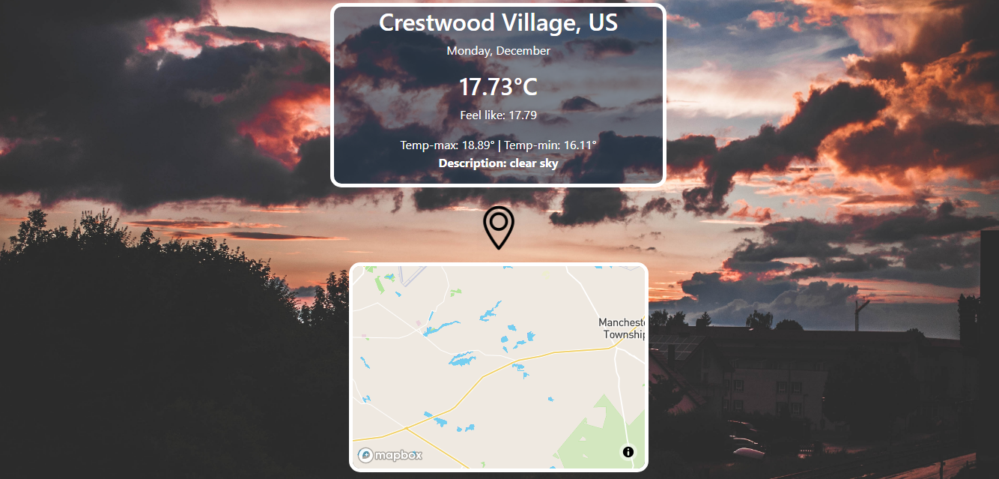

# JavaScript Restaurant Page
This is a weather app that uses Open-Weather-API to get the weather in different cities of the world also use the Unsplash API for the background and Mapbox.js to select the location for latitude and longitude.

## Built With

- JavaScript
- Webpack
- Css
- Unsplah API
- Mapbox.js
- Open-Weather-Api

## Live Demo
[Live Demo Link](https://rawcdn.githack.com/Alexoid1/Weather-app/14f1009e59269c3b32bd62707172026ef5b5fb44/dist/index.html)
 

### Prerequisites

Browser
Internet

## Getting Started

To get a local copy up and running follow these simple example steps:

- Go to https://github.com/Alexoid1/Weather-app and clone the repo using:  
`https://github.com/Alexoid1/Weather-app.git` in your terminal.

### Github Actions

To make sure the linters' checks using Github Actions work properly, you should follow the next steps:

1. On your recently forked repo, enable the GitHub Actions in the Actions tab.
2. Create the `feature/branch` and push.
3. Start working on your milestone as usual.
4. Open a PR from the `feature/branch` when your work is done.

## Authors

👤 **Pablo Alexis Zambrano Coral**
- Github: [@Alexoid1](https://github.com/Alexoid1)
- Twitter: [@Alexis Zambrano_acz](https://twitter.com/pablo_acz)
- Linkedin: [linkedin](https://www.linkedin.com/in/pablo-alexis-zambrano-coral-7a614a189/)

## 🤝 Contributing

Contributions, issues and feature requests are welcome!

Feel free to check the [issues page](https://github.com/Alexoid1/Weather-app/issues).

## Show your support

Give a ⭐️ if you like this project!

## Acknowledgments

- Microverse
- The Odin Project

## 📝 License

This project is [MIT]() licensed.
